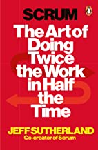

# book-giveaway

Da ich umziehe und nicht alle Bücher mitnehmen will, alles zu verschenken. Wird auf Wunsch CO² neutral per Rad nach Hause geliefert :-)

[Terry Pratchett - Lords und Ladies](https://www.amazon.de/Lords-Ladies-Scheibenwelt-Roman-Pratchett-Broschiert/dp/B010INJ5V8)

[Gregory David Roberts - Shantaram](https://www.amazon.de/Shantaram-Gregory-David-Roberts/dp/0349117543)

[William Golding - Herr der Fliegen](https://www.amazon.de/Herr-Fliegen-Roman-William-Golding/dp/3596214629)

[William Golding - Lord of the flies](https://www.amazon.de/Lord-Flies-William-Golding/dp/3883891657)

<!-- 
[Brian Merchant - The One Device (The secret history of the iPhone)](https://www.amazon.de/One-Device-Secret-History-iPhone/dp/0552173746) -->

[Gillian Flynn - Gone Girl (deutsch)](https://www.amazon.de/Gone-Girl-perfekte-Opfer-Hochkar%C3%A4ter/dp/3596188784)

<!-- 
[Kai Diekmann - Der große Selbstbetrug](https://www.amazon.de/gro%C3%9Fe-Selbstbetrug-Zukunft-gebracht-Taschenbuch/dp/3492253938) -->

[Dan Brown - Illuminati](https://www.amazon.de/Illuminati-Thriller-Dan-Brown/dp/B008G8HTA2)

<!-- 
[Sebastian Fitzek - Der Insasse (hardcover)](https://www.amazon.de/Insasse-Psychothriller-Limitierte-Sonderausgabe/dp/3426281538) -->

[Shell Programmierung für Unix und Linux](https://www.amazon.de/Shell-Programmierung-f%C3%BCr-Unix-Linux-Grundlagen/dp/3446407375)

<!-- 
[Are you smart enough to work at Google?](https://www.amazon.de/Are-Smart-Enough-Work-Google/dp/0316336297) -->

<!-- 
[Bill Bryson - Streiflichter aus Amerika](https://www.amazon.de/Streiflichter-aus-Amerika-Anf%C3%A4nger-Fortgeschrittene/dp/B0024O2KLW) -->

[Ken Follett - Nacht über den Wassern](https://www.amazon.de/Nacht-%C3%BCber-den-Wassern-Belletristik/dp/3785706561)

[Ken Follett - Der Schlüssel zu Rebecca (hardcover)](https://www.amazon.de/Schl%C3%BCssel-zu-Rebecca-Roman/dp/3404104811)

[Ken Follett - Dreifach](https://www.amazon.de/Dreifach-Roman-von-Follett-Taschenbuch/dp/B00FNB4JUI)

[Ken Follett - Eisfieber](https://www.amazon.de/Eisfieber-Roman-Follett-Januar-2006/dp/B0161TY2CU)

[Ken Follett - Der dritte Zwilling](https://www.amazon.de/Ken-Follett-Der-dritte-Zwilling/dp/B009ZW9LRW)

[Ken Follett - Der Modigliani Skandal](https://www.amazon.de/Modigliani-Skandal-Roman-Ken-Follett/dp/3404174534)

<!-- 
[Emmanuel Todd - Weltmacht USA. Ein Nachruf](https://www.goodreads.com/book/show/917837.Weltmacht_USA_Ein_Nachruf) -->

[Denkanstöße 2017](https://www.amazon.de/Denkanst%C3%B6%C3%9Fe-2017-Lesebuch-Philosophie-Wissenschaft/dp/3492308821)

[Latein für Angeber](https://www.amazon.de/Latein-f%C3%BCr-Angeber-Gerald-Drews/dp/3809416258)

[Pascal Mercier - Nachtzug nach Lissabon](https://www.amazon.de/Nachtzug-nach-Lissabon-Pascal-Mercier/dp/3442734363)

[Daniel Kehlmann - Ruhm](https://www.amazon.de/Ruhm-Ein-Roman-neun-Geschichten/dp/349924926X)

<!-- 
[Scrum - The art of doing twice the work in half the time](https://www.amazon.de/Scrum-Doing-Twice-Work-Half/dp/1847941109) -->

[Dennis Rodman - Walk on the wild side](https://www.amazon.de/Walk-Wild-Side-Dennis-Rodman/dp/3423241160)

[Jesus liebt mich](https://www.amazon.de/Jesus-liebt-mich-David-Safier/dp/3499248115)

[Der Vorleser](https://www.amazon.de/Vorleser-Bernhard-Schlink/dp/3257229534)

[Ein Stück Himmel](https://www.amazon.de/Ein-St%C3%BCck-Himmel-Erinnerungen-Kindheit/dp/3423626429)

[Der Minuten Manager](https://www.amazon.de/Minuten-Manager-schult-Hochleistungs-Teams/dp/3499614375)

<!-- 
[Die Eroberung des Südpols](https://www.amazon.de/Die-Eroberung-S%C3%BCdpols-1910-1912-Erdmann/dp/3865398235) -->

[Trotz alledem. Deutsche Radikale 1777-1977](https://www.amazon.de/Trotz-alledem-Deutsche-Radikale-1777-1977/dp/3499171945)

[Volk am Rand](https://www.amazon.de/Volk-Rand-NPD-Perspektiven-Antidemokraten/dp/3360010639)

[Your Home is my Castle](https://www.amazon.de/Your-Home-My-Castle-Wohnungstauscher/dp/3890294928)

[Offenbarungen aus der Traumzeit](https://www.amazon.de/Offenbarungen-Traumzeit-spirituelle-Wissen-Aborigines/dp/3442122740)

[Noch mehr Idioten im Fernsehen](https://www.amazon.de/Noch-mehr-Idioten-Fernsehen-Kn%C3%B6delkaisern/dp/3980677249)

[Das Bildnis des Dorian Gray](https://www.amazon.de/Bildnis-Dorian-Gray-Oscar-Wilde/dp/3958554040)

[Neue Phantastische Phänomene](https://www.amazon.de/Neue-Phantastische-Ph%C3%A4nomene-Rainer-Holbe/dp/3548355234)

[Notstopp](https://www.amazon.de/Notstopp-Ein-Manager-Burn-out-steigt/dp/3839185769)

[Der Name der Rose](https://www.amazon.de/Name-Rose-Umberto-Eco/dp/3423105518)

[Heroin](https://www.amazon.de/Heroin-s%C3%BCchtige-Gesellschaft-Lesebuch-Erwachsene/dp/3922028039)

[Bombenstimmung](https://www.amazon.de/Bombenstimmung-Wenn-alle-denken-Terrorist/dp/3404609565)

[Denkanstöße 2009](https://www.amazon.de/Denkanst%C3%B6%C3%9Fe-2009-Lilo-G%C3%B6ttermann/dp/349225215X)

[Objective-C und Cocoa](https://www.amazon.de/Objective-C-Cocoa-Band-1-Grundlagen/dp/3908498082)

<!-- 
[Qualityland](https://www.amazon.de/QualityLand-Roman-dunkle-Marc-Uwe-Kling/dp/3548291872) -->

[Die Spendenmafia](https://www.amazon.de/Die-Spendenmafia-Schmutzige-Gesch%C3%A4fte-unserem/dp/342678498X)

[Aldi - Einfach billig](https://www.amazon.de/Aldi-Einfach-billig-ehemaliger-Manager/dp/3499629593)

[Deutschland in Sorge](https://www.amazon.de/Deutschland-Sorge-Chronik-Jahres-Altenbockum/dp/3899810805)

[ABC des Philosophierens](https://www.amazon.de/ABC-Philosophierens-Erwin-Lebek/dp/3811204807)

[Hell's Angels](https://www.amazon.de/Angels-Penguin-Essentials-Hunter-Thompson/dp/0241951585)

[Massenmedien in Deutschland](https://www.amazon.de/Massenmedien-Deutschland-Einzeltitel-Kommunikationswissenschaft-Hermann/dp/3896694200)

[Salman Rushdie - Harun und das Meer der Geschichten (hardcover)](https://www.amazon.de/Harun-Meer-Geschichten-Salman-Rushdie/dp/3463401533)

[Salman Rushdie - Osten, Westen](https://www.amazon.de/Osten-Westen-Kurzgeschichten-Salman-Rushdie/dp/3442746612)

[Salman Rushdie - Zwei Jahre Acht Monate und Achtundzwanzig Tage](https://www.amazon.de/Zwei-Jahre-Monate-achtundzwanzig-N%C3%A4chte/dp/332810142X)

[Salman Rushdie - Der Boden unter ihren Füssen](https://www.amazon.de/Boden-unter-ihren-F%C3%BC%C3%9Fen/dp/3499228890)

<!-- 
[10.000 Träume](https://www.amazon.de/10-000-Tr%C3%A4ume-Traumsymbole-ihre-Bedeutung/dp/34421686009) -->

[Handbuch der Traumsymbole](https://www.amazon.de/Das-Handbuch-Traum-Symbole-Bildsprache-verstehen/dp/3453700651)

[Spektrum der Nacht](https://www.amazon.de/Spektrum-Nacht-schlafen-klar-tr%C3%A4umen/dp/3930243261)

[Cryptonomicon](https://www.amazon.de/Cryptonomicon-Neal-Stephenson/dp/0060512806)

[Kosten- und Erlösrechnung (5. Auflage)](https://www.amazon.de/Kosten-Erl%C3%B6srechnung-Controllingorientierte-Einf%C3%BChrung-Springer-Lehrbuch/dp/3540737715)

[Kosten- und Erlösrechnung - Arbeitsbuch (4. Auflage)](https://www.springer.com/de/book/9783540245438)

[Scientifica](https://www.amazon.de/Scientifica-Meilensteine-aus-Welt-Wissenschaft/dp/3848001594)

[Karl Marx - Das Kapital (hardcover)](https://www.amazon.de/Das-Kapital-Kommunistische-Manifest-Produktionsprozess/dp/3893400753)
