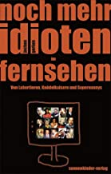
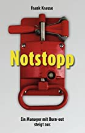
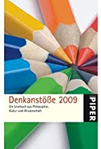
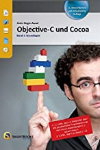
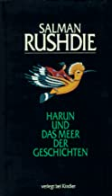
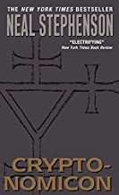
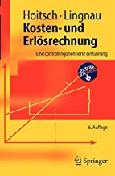

# book-giveaway

Da ich ausziehe und nicht alle Bücher mitnehmen will, alles zu verschenken:

[Jesus liebt mich](https://www.amazon.de/Jesus-liebt-mich-David-Safier/dp/3499248115)

[Der Vorleser](https://www.amazon.de/Vorleser-Bernhard-Schlink/dp/3257229534)

[Ein Stück Himmel](https://www.amazon.de/Ein-St%C3%BCck-Himmel-Erinnerungen-Kindheit/dp/3423626429)

[Der Minuten Manager](https://www.amazon.de/Minuten-Manager-schult-Hochleistungs-Teams/dp/3499614375)

[Die Eroberung des Südpols](https://www.amazon.de/Die-Eroberung-S%C3%BCdpols-1910-1912-Erdmann/dp/3865398235)

[Trotz alledem. Deutsche Radikale 1777-1977](https://www.amazon.de/Trotz-alledem-Deutsche-Radikale-1777-1977/dp/3499171945)

[Volk am Rand](https://www.amazon.de/Volk-Rand-NPD-Perspektiven-Antidemokraten/dp/3360010639)

[Your Home is my Castle](https://www.amazon.de/Your-Home-My-Castle-Wohnungstauscher/dp/3890294928)

[Offenbarungen aus der Traumzeit](https://www.amazon.de/Offenbarungen-Traumzeit-spirituelle-Wissen-Aborigines/dp/3442122740)

[Noch mehr Idioten im Fernsehen](https://www.amazon.de/Noch-mehr-Idioten-Fernsehen-Kn%C3%B6delkaisern/dp/3980677249)

[Das Bildnis des Dorian Gray](https://www.amazon.de/Bildnis-Dorian-Gray-Oscar-Wilde/dp/3958554040)

[Neue Phantastische Phänomene](https://www.amazon.de/Neue-Phantastische-Ph%C3%A4nomene-Rainer-Holbe/dp/3548355234)

[Notstopp](https://www.amazon.de/Notstopp-Ein-Manager-Burn-out-steigt/dp/3839185769)

[Der Name der Rose](https://www.amazon.de/Name-Rose-Umberto-Eco/dp/3423105518)

[Heroin](https://www.amazon.de/Heroin-s%C3%BCchtige-Gesellschaft-Lesebuch-Erwachsene/dp/3922028039)

[Bombenstimmung](https://www.amazon.de/Bombenstimmung-Wenn-alle-denken-Terrorist/dp/3404609565)

[Denkanstöße 2009](https://www.amazon.de/Denkanst%C3%B6%C3%9Fe-2009-Lilo-G%C3%B6ttermann/dp/349225215X)

[Objective-C und Cocoa](https://www.amazon.de/Objective-C-Cocoa-Band-1-Grundlagen/dp/3908498082)

[Qualityland](https://www.amazon.de/QualityLand-Roman-dunkle-Marc-Uwe-Kling/dp/3548291872)

[Die Spendenmafia](https://www.amazon.de/Die-Spendenmafia-Schmutzige-Gesch%C3%A4fte-unserem/dp/342678498X)

[Aldi - Einfach billig](https://www.amazon.de/Aldi-Einfach-billig-ehemaliger-Manager/dp/3499629593)

[Deutschland in Sorge](https://www.amazon.de/Deutschland-Sorge-Chronik-Jahres-Altenbockum/dp/3899810805)

[ABC des Philosophierens](https://www.amazon.de/ABC-Philosophierens-Erwin-Lebek/dp/3811204807)

[Hell's Angels](https://www.amazon.de/Angels-Penguin-Essentials-Hunter-Thompson/dp/0241951585)

[Massenmedien in Deutschland](https://www.amazon.de/Massenmedien-Deutschland-Einzeltitel-Kommunikationswissenschaft-Hermann/dp/3896694200)

[Harun und das Meer der Geschichten](https://www.amazon.de/Harun-Meer-Geschichten-Salman-Rushdie/dp/3463401533)

[Osten, Westen](https://www.amazon.de/Osten-Westen-Kurzgeschichten-Salman-Rushdie/dp/3442746612)

[Zwei Jahre Acht Monate und Achtundzwanzig Tage](https://www.amazon.de/Zwei-Jahre-Monate-achtundzwanzig-N%C3%A4chte/dp/332810142X)

[Der Boden unter ihren Füssen](https://www.amazon.de/Boden-unter-ihren-F%C3%BC%C3%9Fen/dp/3499228890)

[10.000 Träume](https://www.amazon.de/10-000-Tr%C3%A4ume-Traumsymbole-ihre-Bedeutung/dp/34421686009)

[Handbuch der Traumsymbole](https://www.amazon.de/Das-Handbuch-Traum-Symbole-Bildsprache-verstehen/dp/3453700651)

[Spektrum der Nacht](https://www.amazon.de/Spektrum-Nacht-schlafen-klar-tr%C3%A4umen/dp/3930243261)

[Cryptonomicon](https://www.amazon.de/Cryptonomicon-Neal-Stephenson/dp/0060512806)

[Kosten- und Erlösrechnung (5. Auflage)](https://www.amazon.de/Kosten-Erl%C3%B6srechnung-Controllingorientierte-Einf%C3%BChrung-Springer-Lehrbuch/dp/3540737715)

[Kosten- und Erlösrechnung - Arbeitsbuch (4. Auflage)](https://www.springer.com/de/book/9783540245438)

[Scientifica](https://www.amazon.de/Scientifica-Meilensteine-aus-Welt-Wissenschaft/dp/3848001594)